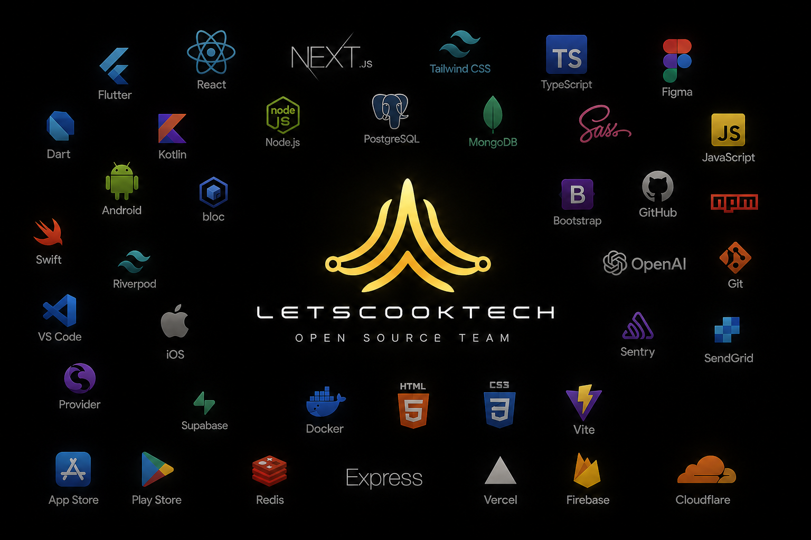

# AI Engineering Arsenal



**Production-grade AI engineering skills, audits, workflows, benchmarks, and evaluation frameworks.**

The open-source AI engineering framework for architecture reviews, security audits, startup validation, competitor analysis, AI systems design, SEO audits, AI code review, technical due diligence, and technical decision-making.

Built for developers, founders, CTOs, technical teams, and AI builders.

Developed by the LetsCookTech Open Source Team.

## Why use AI Engineering Arsenal instead of asking an AI directly?

Default AI answers are often plausible but hard to trust: they skip evidence, confuse guesses with facts, miss release risks, and leave no test path. AI Engineering Arsenal gives an assistant an operational contract: what to inspect, what to prove, what to refuse, how to verify, and what artifact to hand to a human.

The reputation this project is designed to earn:

> This framework catches things normal AI misses.

AI Engineering Arsenal is currently a library of cross-model operating skills. The long-term direction is an AI engineering operating layer for routing, evaluation, policy, and lifecycle. The current repository is intentionally honest about what exists today.

## What it helps with

- AI code review
- Security audit AI workflows
- Architecture review and system design
- Startup validation
- Competitor analysis
- Technical due diligence
- Engineering playbooks and engineering workflows
- AI evaluation and benchmark design
- AI CTO operating rhythms
- SaaS, Supabase, Next.js, RAG, and AI agent decision-making

## See the difference

| Without a playbook | With an Arsenal playbook |
| --- | --- |
| "Add authentication and validate inputs." | Maps assets and trust boundaries; reports evidence, preconditions, impact, remediation, regression tests, confidence, and review gaps. |
| "Use a queue and a database." | Compares designs, records assumptions and trade-offs, specifies timeouts/retries/rollback, and names the test that validates the decision. |
| "Build an AI SaaS." | Produces an acceptance contract plus tenancy, authorization, AI-evaluation, cost-cap, migration, observability, release, and rollback gates. |

Read a safe, concrete finding from the [synthetic tenant-review case study](case-studies/security-auditor-synthetic-tenant-review.md). It demonstrates an evidence-linked result; it does **not** claim a benchmark win.

## Start with these four

| Playbook | Use it when | Proof path |
| --- | --- | --- |
| [`security-auditor`](skills/security-auditor) | You need an authorized code, API, infra, or release-risk review. | [Case study](case-studies/security-auditor-synthetic-tenant-review.md) · [Rubric](benchmarks/security-auditor/evaluation-rubric.md) |
| [`startup-validator`](skills/startup-validator) | You need to test whether a product should exist before building it. | [Case study](case-studies/startup-validator-concierge-test.md) · [Rubric](benchmarks/startup-validator/evaluation-rubric.md) |
| [`competitor-analyzer`](skills/competitor-analyzer) | You need positioning based on evidence rather than a feature grid. | [Case study](case-studies/competitor-analyzer-market-map.md) · [Rubric](benchmarks/competitor-analyzer/evaluation-rubric.md) |
| [`cto-operating-system`](skills/cto-operating-system) | You need a focused operating plan from engineering signals. | [Case study](case-studies/cto-operating-system-quarterly-reset.md) · [Rubric](benchmarks/cto-operating-system/evaluation-rubric.md) |

## Use a playbook

Copy a skill folder into your agent's skills directory, or attach its `SKILL.md` to the task. Example:

```text
Use $security-auditor to review this authorized SaaS API. Scope: /api/invoices.
Evidence: repository files and deployment configuration attached.
Return only confirmed findings, review gaps, safe remediation, and verification tests.
```

Works as portable Markdown with Codex, Claude Code/Projects, ChatGPT, Gemini, Cursor, Windsurf, Cline, Roo Code, Aider, and agent SDKs. See [compatibility](docs/COMPATIBILITY.md).

## First wave

`security-auditor` · `startup-validator` · `competitor-analyzer` · `system-architect` · `database-architect` · `technical-debt-hunter` · `ai-search-optimizer` · `seo-auditor` · `cost-explosion-detector` · `cto-operating-system` · `production-ai-saas-builder`

## Evidence, not marketing

AI Engineering Arsenal does not claim that a playbook finds more issues, saves money, or outperforms a model until a reproducible result is published. Each benchmark holds model/version, tools, temperature, budget, inputs, rubric, baseline, playbook run, evaluator, and limitations constant. Read the [benchmark protocol](benchmarks/README.md).

## Trust system

AI Engineering Arsenal has a repository-level system for improving itself instead of only adding more skills:

| System | Purpose |
| --- | --- |
| [Repository audit](docs/REPOSITORY-AUDIT.md) | Finds weak assets, filler risk, missing proof, and deletion candidates. |
| [Arsenal constitution](docs/ARSENAL-CONSTITUTION.md) | Defines the laws every contribution must follow. |
| [AI CTO operating model](docs/OPERATING-MODEL.md) | Standardizes input, research, verification, risk review, decision, and quality review. |
| [Evaluation standard](docs/EVALUATION-STANDARD.md) | Scores outputs across accuracy, evidence, verification, actionability, security, and user value. |
| [Red-team framework](docs/RED-TEAM-FRAMEWORK.md) | Attacks outputs before users trust them. |
| [Benchmark lab](docs/BENCHMARK-LAB.md) | Defines the proof artifacts required before performance claims. |
| [Self-evolution roadmap](docs/SELF-EVOLUTION.md) | Moves the project toward a proof engine, runtime adapters, and Open Source AI CTO workflows. |

## FAQ

### Is this just a prompt repository?

No. A prompt repository optimizes for copyable text. AI Engineering Arsenal optimizes for evidence, verification, failure detection, benchmarks, and repeatable engineering decisions.

### Is this tied to one AI model?

No. The playbooks are Markdown-first and model-portable. They are designed for Claude, ChatGPT, Gemini, Codex, Cursor, Windsurf, Cline, Roo Code, Aider, OpenAI Agents, Anthropic agents, and future AI systems.

### Does it already prove benchmark superiority?

Not yet. The repository includes rubrics, synthetic case studies, and benchmark protocol. Public benchmark wins should only be claimed after raw baseline and framework outputs are published.

## Contribute a useful playbook

A contribution needs a recurring decision problem, an evidence/verification contract, safety boundaries, and a sanitized evaluation case. Generic personas and untested prompt collections do not qualify. Start with [CONTRIBUTING.md](CONTRIBUTING.md).

## Repository map

| Path | Purpose |
| --- | --- |
| [`skills/`](skills) | Portable operating playbooks. |
| [`case-studies/`](case-studies) | Safe, concrete demonstrations of the output standard. |
| [`benchmarks/`](benchmarks) | Per-playbook rubrics and reproducibility protocol. |
| [`evals/`](evals) | Versioned task fixtures for baseline-versus-playbook runs. |
| [`docs/`](docs) | Product thesis, compatibility, launch, and publishing guidance. |
| [`templates/`](templates) | Proof-pack templates for graduating skills into trusted assets. |

## Status

`v0.1.0` is a foundation release. Case studies are synthetic demonstrations; public benchmark results are not yet published. That distinction is intentional.

Developed by the LetsCookTech Open Source Team.

## License

MIT. See [LICENSE](LICENSE).
