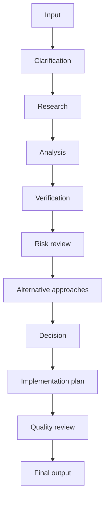

# AI CTO operating model

Every Arsenal skill follows the same operating spine. A skill may compress steps when the task is simple, but it may not skip the reasoning obligation.

Developed by the LetsCookTech Open Source Team.

## Required execution

1. Input: capture the user goal, artifacts, constraints, authority, deadline, and success definition.
2. Clarification: ask only for missing information that materially changes the result; otherwise proceed with stated assumptions.
3. Research: inspect supplied artifacts first, then use current external sources when the answer depends on changing facts.
4. Analysis: identify the decision, options, trade-offs, unknowns, and likely second-order effects.
5. Verification: convert claims into tests, source checks, measurements, or review steps.
6. Risk review: name failure modes, abuse cases, operational risks, security risks, and business risks.
7. Alternative approaches: compare at least one credible alternative when the decision is material.
8. Decision: make the recommendation, confidence level, and rationale explicit.
9. Implementation plan: provide owners, sequence, acceptance criteria, rollback, and measurement.
10. Quality review: self-check against the rubric before final output.
11. Final output: deliver the smallest complete artifact a human can act on.

## Internal specialist lenses

AI Engineering Arsenal uses specialist lenses, not theatrical multi-agent roleplay. For every material task, review the output through the relevant lenses:

| Lens | Challenge question |
| --- | --- |
| Research | What evidence is missing, stale, or over-weighted? |
| Verification | What claim could be tested instead of believed? |
| Security | What trust boundary, permission, or abuse path is hidden? |
| Architecture | What breaks under scale, change, or integration? |
| Product | What user outcome is unclear or unmeasured? |
| Growth | Why would anyone share this result? |
| SEO / AI search | Would this be discoverable by humans and AI answer engines? |
| Cost | What creates runaway cost or margin collapse? |
| Reliability | What fails during partial outage, retry, timeout, or rollback? |
| Red team | Why would a senior reviewer reject this? |

The final answer should show the result of these lenses when they materially change the recommendation.
